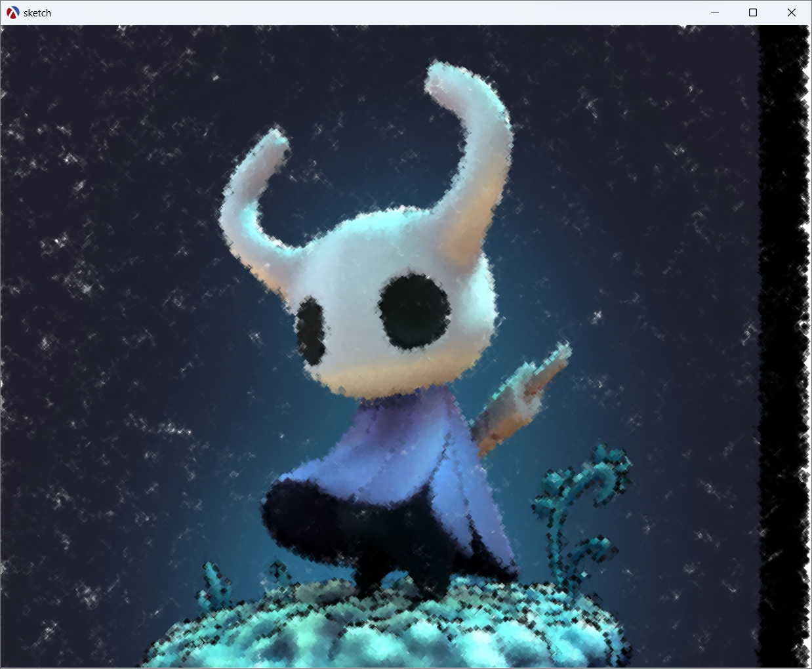

## Nombre del Proyecto Principal
proyecto.rkt
### Autor: Alisson Constantine

## Características

El proyecto dibuja una imagen establecida por el usuario utilizando la técnica de puntillismo.
Se basó en código utilizado en: https://github.com/processing/processing-docs/blob/master/content/examples/Basics/Image/Pointillism/Pointillism.pde

Se aumentaron las funcionalidades detalladas a continuación:
- Para cambiar las formas para dibujar, se puede utilizar las teclas a continuación:
    - q: forma triángulo.
    - w: forma círculo.
    - e: forma cuadrado.
    - r: forma diamante.
- Para aumentar o disminuir el tamaño del pincel de pueden utilizar:
    - a: reducir el tamaño en 5px.
    - s: aumentar el tamaño en 5px.
- Se modificó para que la escena se vaya completando de izquierda a derecha en vez de aleatoriamente como en la versión original.

## Ejemplos de Funcionamiento
Como se muestra en la figura a continuación la imagen se va completando de izquierda a derecha.

Una vez que llega a la derecha regresa el pincel hasta llegar a la izquierda.

Se puede cambiar las formas del pincel

Así como también su tamaño.

Se puede dejar ejecutando el programa, hasta obtener el resultado deseado:
Imagen Orginal

Imagen Obtenida

El programa fue ejectudo y programado utilizando DrRacket.
